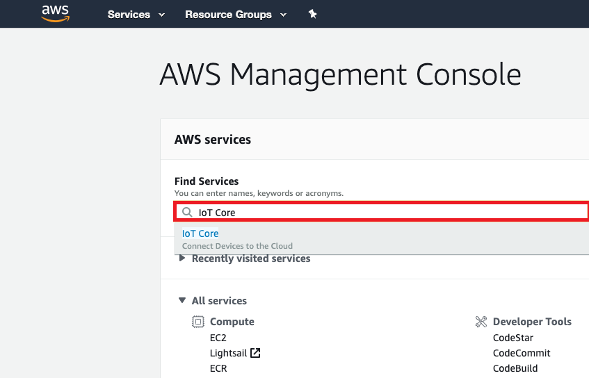
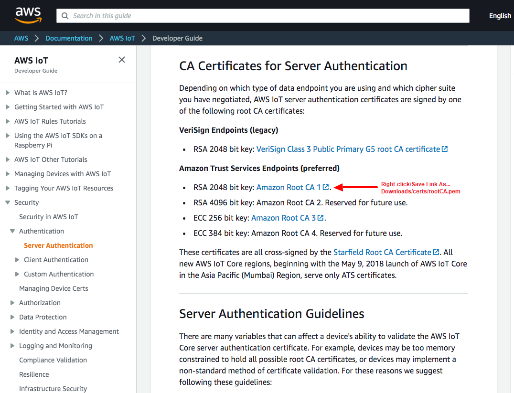
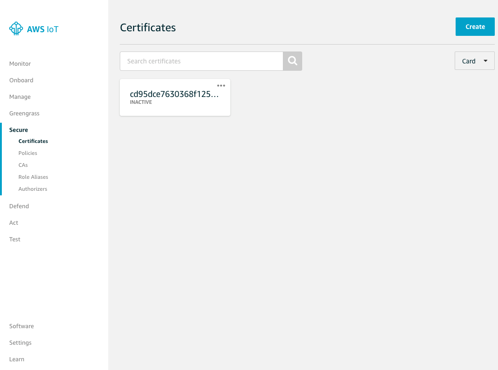
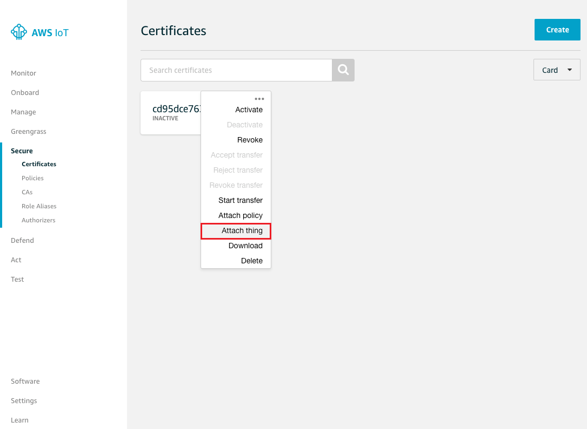
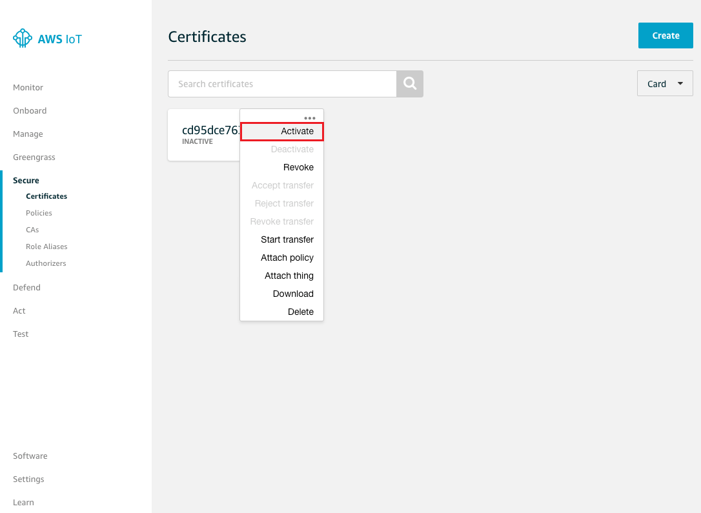
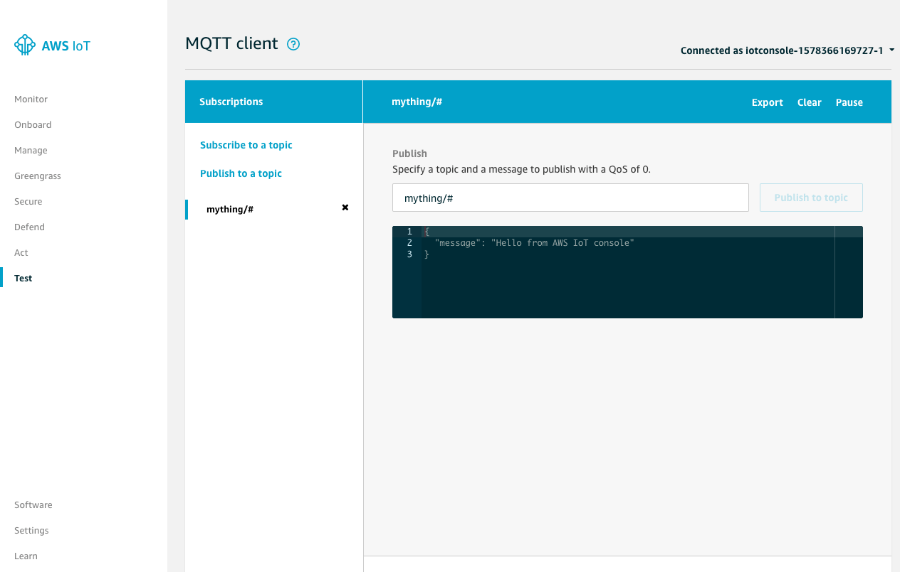
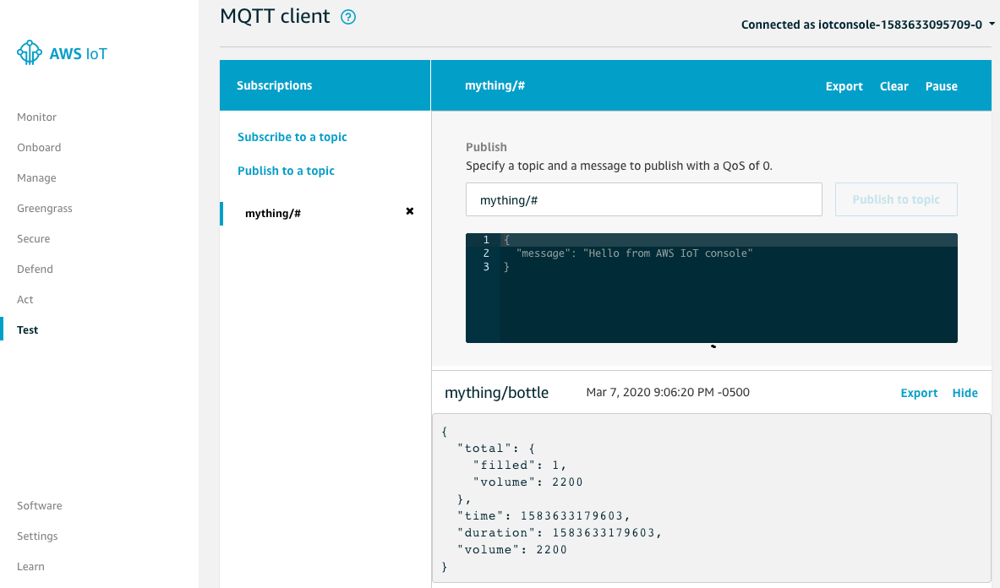
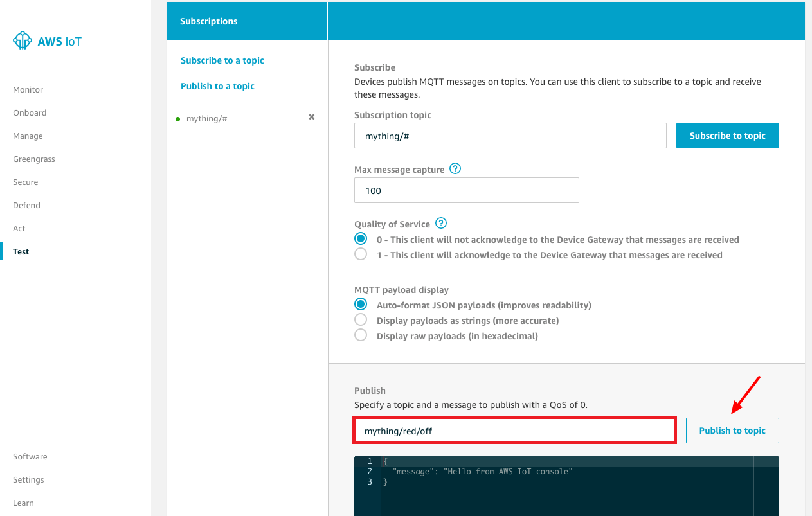

# PART 2: AWS IoT Device Registration

In this lab you will convert your virtual device program, which can control and monitor its attached virtual sensors, to securely connect as a **"Thing"** to the AWS IoT cloud. We will also enhance your application to function as a water dispensing station. Specifically, we will monitor the proximity sensor to detect water bottles being placed into and removed from the water dispenser. When we detect that a water bottle is in the water dispenser, we'll indiate that this event has been detected on the LCD display attached to the virtual device. When the water bottle is detected for longer than a configurable number of seconds (e.g. 2 seconds) we will trigger an event indicating that the water bottle is being filled. When the water bottle is removed, a proximity event indicating this will trigger it to indicate that the filling is completed. This will result in the application emitting a **beep** on the buzzer and updating the LCD display attached to the virtual device. The LCD display will indicate the accumulated total number of bottles filled as well as the current state - **Idle**, **Detected** or **Filling**. Additionally, IoT events will be published to AWS IoT Core via secure MQTT messages. These events include the state of the water dispenser as it changes from **Idle** to **Detected** to **Filling** as well as an event indicating that a water bottle has been filled. This **bottle filled** event will include data such as the time it was filled, the duration to fill it and the amount of water dispensed.

### Architecture

   

### 1. Register your device to AWS IoT Core
   - Login to AWS console and ensure your region is **US East (N. Virginia)**

   

   - Go to **Services/IoT Core** by entering **IoT Core** in the Find Services field and pressing **Enter**

   

   - If this is the first time you've used **IoT Core** you may be presented with a **Get Started** dialog
   - Press the **Get started** button to continue

   

   - Select **Manage/Things**
   - Press **Register a thing** button

   

   - Press **Create a single thing** button
   

   
   
   - Enter **Name=mything** and press **Next** button
   

   

### 2. Create a certificate for your IoT thing
   - Press **Create certificate** button

   

   - Download **A certificate for this thing** and save it as **Downloads/certs/cert.pem** on your laptop
   - Download **public key** and save it as **Downloads/certs/public.pem** on your laptop
   - Download **private key** and save it as **Downloads/certs/private.pem** on your laptop
   - Download **A root CA for AWS IoT** save it as **Downloads/certs/rootCA.pem** on your laptop

   
---
   
---
   - Close the CA Certificates tab pane once you've dowloaded your root CA cert file.
   - Press **Done** button *(make sure you've downloaded your certs as shown above before you do this)*

   

### 3. Create an IoT Policy for your Thing
   - Select **Secure/Policies**
   - Press "Create a policy" button

   
   
   - Enter **Name=mything-policy**
   - Enter **Action=iot:\***
   - Enter **Resource ARN=\***
   - Select **Effect=Allow**
   - Press **Create** button 
     *NOTE: Typically you would make a more constrained policy in a production environment*

   
---
   

### 4. Attach your IoT Policy to the device certificate
   - Select **Secure/Certificates**
   - Select **...** pulldown menu of your certificate, and select **Attach policy**

   

   - select your policy **mything-policy**
   - press **Attach** button

   
   

### 5. Attach your certificate to your Thing and activate the certificate
   - Select **Secure/Certificates**
   - Select **...** pulldown menu of your certificate, and select **Attach thing**

   

   - Select your thing **mything**
   - Press **Attach** button

   

   - We'll now activate your certificate.
   - Select **...** pulldown menu of your certificate, and select **Activate**

   

### 6. Locate your IoT Custom Endpoint value
   - Select **Settings** and take note of your **Custom Endpoint** (your value may differ from the example shown below). 
   

   **NOTE: Save this value in your notes for the future. It will be used when you configure the host which your IoT code will connect to below**

   

### 7. Secure copy your previously saved **mything** IoT certificates onto your virtual IoT device

   - Launch the **Google Chrome Secure Shell App** in another tab to start a SFTP session
   - Enter a username of **ec2-user**, the IP address of your EC2 instance, enter port 22, select an Identity of **iot-virtual-device.pem** and press the **SFTP** button.

   

  nasftp ./ > **cd ~/iot-greentech-device-simulator-master** 
  nasftp /home/ec2-user/iot-greentech-device-simulator-master/ > **mkdir certs** 
  nasftp /home/ec2-user/iot-greentech-device-simulator-master/ > **cd certs** 
  nasftp /home/ec2-user/iot-greentech-device-simulator-master/certs/ > **put** 

   

  - Select your **mything** IoT certs that you previously stored in **Downloads/certs**

**IMPORTANT: Make sure the names of your files are EXACTLY as shown below. If not you should rename the files to match those exact names or you will not be able to connect your thing successfully to AWS IoT**

   

### 8. SSH onto your virtual device using Chrome SSH App

   - Launch the **Google Chrome Secure Shell App** in another tab to start a SSH session
   - Enter a username of **ec2-user**, the IP address of your EC2 instance, enter port 22, select an Identity of **iot-virtual-device.pem** and press the **[Enter] Connect** button.

   

### 9. Update your application to connect to AWS IoT Core as your **mything** you previously created using the AWS Console

   [ec2-user@ip-172-31-29-44 ~]$ **cd ~/iot-greentech-device-simulator-master** 
   [ec2-user@ip-172-31-29-44 ~]$ **npm install -s aws-iot-device-sdk** 

   
   - Use your favorite editor to modify the test program to connect to AWS IoT Core.  

   [ec2-user@ip-172-31-29-44 ~]$ **nano index.js** *(press control-X to exit and press Y to save the file)* 
   

   

   The highlighted lines in the code below are the lines added to securely connect to AWS IoT Core as well as the additional water dispensing functionality. This was provided for educational purposes and you may find it easier to simply cut-and-paste the entire code.

   **IMPORTANT: Replace the host: value with the Custom Endpoint value you took note of earlier** 
   **HINT: If you forgot your Custom Endpoint value you can get it from Iot Core/Settings** 
   **HINT: When using nano use shift and arrow keys to select text and control-K to delete text** 
   **HINT: Right mouse button may be used to copy and paste when using Google Chrome SSH**

<pre>
<b style="color:red">const AWSIoT  = require('aws-iot-device-sdk');</b>
const express  = require('express');
const http     = require('http');
const minimist = require('minimist');
const WS       = require('ws');

const DEFAULT_PORT = 8080;

const app    = express();
const server = http.createServer(app);
const wss    = new WS.Server({ server });
<b style="color:red">
const DETECT_PROXIMITY = 5;
const DETECT_DURATION  = 2;    // 2 secs
const DISPENSE_RATE    = 200;  // 200 ml/sec
const MONITOR_INTERVAL = 1000; // 1000 msecs

const IDLE     = 0;
const DETECTED = 1;
const FILLING  = 2;

let device      = null;
let state       = IDLE; // IDLE, DETECTED or FILLING (Default = IDLE)
let prox        = 200;  // 0 = nearest, 200 = farthest (Default = 200)
let temperature = 70;   // Fahrenheit (Default =70)
let time        = Date.now();
let total       = { filled: 0, volume: 0 };
</b>
function main() {
  let args = minimist(process.argv.slice(2));
  let port = args.port || DEFAULT_PORT;

  app.use('/', express.static('./web'));

  wss.on('connection', onWebSocketConnect);

  server.listen(port, () => {
    console.log('Listening: port=' + server.address().port);
  });
  <b style="color:red">
  device = AWSIoT.device({
    keyPath:  './certs/private.pem',
    certPath: './certs/cert.pem',
    caPath:   './certs/rootCA.pem',
    clientId: 'mything',
    region:   'us-east-1',
    protocol: 'mqtts',
    // IMPORTANT: REPLACE THE HOST VALUE BELOW WITH YOUR CUSTOM ENDPOINT VALUE
    host:     'a26erfmc9c0soi-ats.iot.us-east-1.amazonaws.com',
    debug:    'true'
  });

  device.on('connect', onConnect);
  device.on('message', onMessage);</b>
}
<b style="color:red">
function onConnect() {
  console.log('Connected to AWS IoT Core');
  device.subscribe('mything/beep');
  device.subscribe('mything/red/#');
  device.subscribe('mything/blue/#');
  device.publish('mything/dispenser', '{ "state": "idle", "time": ' + Date.now() + ' }');
}

function onMessage(topic, buffer) {
  if (topic === 'mything/beep') {
    beep();
  }
  else if (topic === 'mything/red/on') {
    red(1);
  }
  else if (topic === 'mything/red/off') {
    red(0);
  }
  else if (topic === 'mything/blue/on') {
    blue(1);
  }
  else if (topic === 'mything/blue/off') {
    blue(0);
  }
}
</b>
function onWebSocketConnect(ws, req) {
  console.log('WebSocket Connected');

  ws.on('message', onWebSocketMessage);
  <b style="color:red">setInterval(monitor, MONITOR_INTERVAL);</b>

  flash();
  beep();
}

function onWebSocketMessage(message) {
  let msg = JSON.parse(message);

  if (msg.sensor === 'angle') {
    console.log('Angle: ' + msg.value);
    angle(msg.value);
    <b style="color:red">temperature = msg.value;
    device.publish('mything/temperature', '{ "value":' + temperature + ' }');</b>
  }
  else if (msg.sensor === 'proximity') {
    console.log('Proximity: ' + msg.value);
    proximity(msg.value);
    <b style="color:red">prox = msg.value;</b>
  }
}

function flash() {
  console.log('Flash');

  red(1);
  setTimeout(() => { red(0); }, 1000);
}

function beep() {
  console.log('Beep');

  buzzer(1);
  setTimeout(() => { buzzer(0); }, 1000);
}

function red(value) {
  send({ command: 'red', value: value });
}

function blue(value) {
  send({ command: 'blue', value: value });
}

function angle(value) {
  send({ command: 'angle', value: value });
}

function proximity(value) {
  send({ command: 'proximity', value: value });
}

function buzzer(value) {
  send({ command: 'buzzer', value: value });
}

<b style="color:red">
function monitor() {
  let now       = Date.now();
  let duration  = Math.floor((now - time) / 1000);

  if (state === IDLE) {
    if (prox > DETECT_PROXIMITY) {
      display('Idle', prox, total.filled, 'green');
    }
    else {
      state = DETECTED;
      time  = now;
      display('Detected', prox, total.filled, 'blue', 0);
      device.publish('mything/dispenser', '{ "state":"detected" , "time":' + now + ' }');
    }
  }
  else if (state === DETECTED) {
    if (prox > DETECT_PROXIMITY) {
      state = IDLE;
      display('Idle', prox, total.filled, 'green');
      device.publish('mything/dispenser', '{ "state":"idle", "time":' + now + ' }');
    }
    else if (duration >= DETECT_DURATION) {
      state = FILLING;
      time  = now;
      display('Filling', prox, total.filled, 'red', duration);
      device.publish('mything/dispenser', '{ "state":"filling", "time":' + now + ' }');
    }
    else {
      display('Detected', prox, total.filled, 'blue', duration);
    }
  }
  else if (state == FILLING) {
    if (prox > DETECT_PROXIMITY) {
      let dispensed = duration * DISPENSE_RATE;

      state = IDLE;
      total.filled += 1;
      total.volume += dispensed;
      beep();

      display('Idle', prox, total.filled, 'green');
      device.publish('mything/dispenser', '{ "state":"idle", "time":' + now + ' }');
      device.publish('mything/bottle', '{ "total":{ "filled":' + total.filled + ', "volume":' + total.volume + '},' +
                                          '"time":' + now + ', "duration":' + duration + ', "volume":' + dispensed + ' }');
    }
    else {
      display('Filling', prox, total.filled, 'red', duration);
    }
  }
}
</b>
function display(state, prox, filled, color, duration) {
  let text = 'Filled: ' + filled + '&lt;br&gt;' + state + '[' + prox + ']';

  if (duration) {
    text += ': ' + duration + 's';
  }

  console.log(text);
  send({ command: 'display', text: text, color: color });
}

function send(command) {
  wss.clients.forEach((ws) => {
    if (ws.readyState === WS.OPEN) {
      ws.send(JSON.stringify(command));
    }
  });
}

main();
</pre>

### 10. Show connectivity to AWS IoT Core and test your **mything**
   - Login to AWS console
   - Go to **Services/IoT Core**
   - Select **Test**
   - Subscribe **topic=mything/#** and press **Subscribe to topic** button

   

   - Once subscribed, you'll see a message "Hello from AWS IoT console"

   

### 11. Connect your virtual device as **mything** to AWS IoT Core

   - Go back to your tab where you're SSH-ed onto your virtual device and run the program. Make sure you first kill any old versions which may be running.  

   [ec2-user@ip-172-31-29-44 ~]$ **cd ~/iot-greentech-device-simulator-master** 
   [ec2-user@ip-172-31-29-44 ~]$ **sudo killall node** 
   [ec2-user@ip-172-31-29-44 ~]$ **sudo node index.js --port=80** 

   

   - The application indicates "Connected to AWS IoT Core"
   - The IoT Test page shows an incoming message indicating the application state and time

   

   **Load your virtual device web page for testing**

   - Open another tab in Chrome
   - Enter a URL of **http://YOUR-EC2-INSTANCE-PUBLIC-IP-ADDRESS**
   - You should be presented with the virtual IoT device simulator as shown below.
   - Press the **OK** button. Once pressed the **Red LED** will flash and the buzzer will beep indicating it is connected and online. 

   

   - Move the proximity **slider** all the way to the right until it shows 100 (no bottles near water station)
   - Move the proximity **slider** all the way back to the left until it shows 0 (water bottle in water station)
   - After 10 seconds move the proximity **slider** to the right until it's greater than 10 (water bottle removed)

   

   - Notice the state of the LCD display change to reflect its current state and proximity
   - Notice water bottle filled events detected by the virtual IoT device and published

   

   - Move the angle **slider** on the virtual device and simulate incoming **temperature** messages

   

   - Publish a message to beep the buzzer on the virtual device
   - Enter a Publish **topic** of **mything/beep**
   - Press **Publish to topic** button

   

   - Publish a message to turn on the red LED attached to the virtual device
   - Enter a Publish **topic** of **mything/red/on**
   - Press the **Publish to topic** button

   

   - Publish a message to turn off the red LED attached to the virtual device
   - Enter a Publish **topic** of **mything/red/off**
   - Press the **Publish to topic** button

   

   - Publish a message to turn on the blue LED attached to the virtual device
   - Enter a Publish **topic** of **mything/blue/on**
   - Press the **Publish to topic** button

   

   - Publish a message to turn off the blue LED attached to the virtual device
   - Enter a Publish **topic** of **mything/blue/off**
   - Press the **Publish to topic** button

   

# Continue Workshop

[Part 3 - AWS IoT Rules](./Workshop3-Virtual-rules.md)