# PART 3: AWS IoT Rules

In this lab you will create IoT rules to sense and respond to IoT telemetry events published from your virual IoT device and its simulated sensors. Specifically, you will write rules to monitor the water temperature of the water dispensor and respond with actions to turn on/off the cooler based on configured water temperature values. You will step-wise progress to create more advanced rules. Ultimately, you will finish with creating an advanced IoT rule which will make use of a Lambda function to create a phone call to your cell phone to play a notification message to you.

### Architecture

   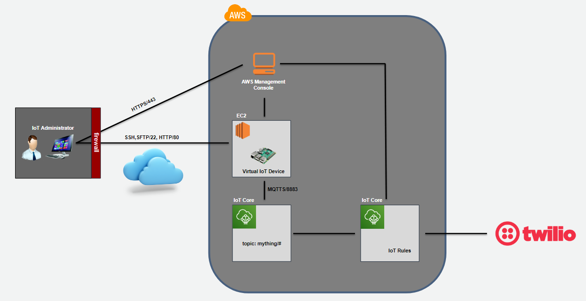

### 1. Create an IAM Role for use when executing your IoT Rule Actions
   - Select **Services/IAM** and select **Roles**
   - Press **Create role** button

   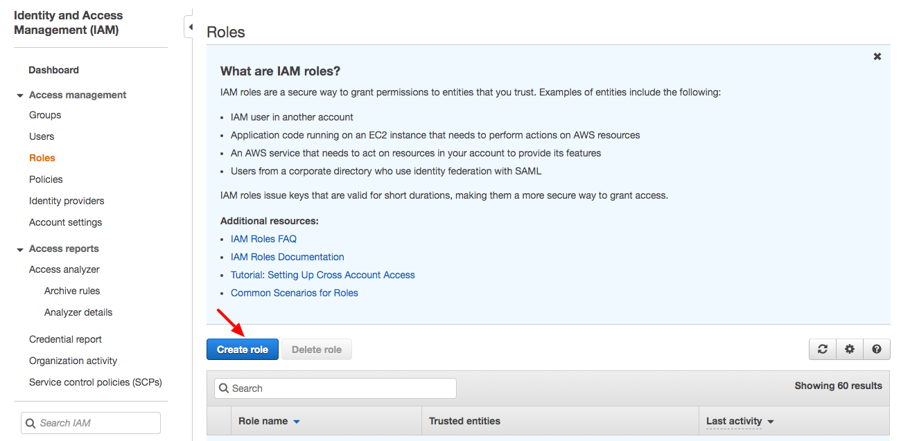
   - Select **AWS service** as the trusted entity
   - Select **IoT** as the service using the Role
   - Select **IoT** as your use case
   - Press **Next: Permissions** button

   
   - Press **Next: Tags** button

   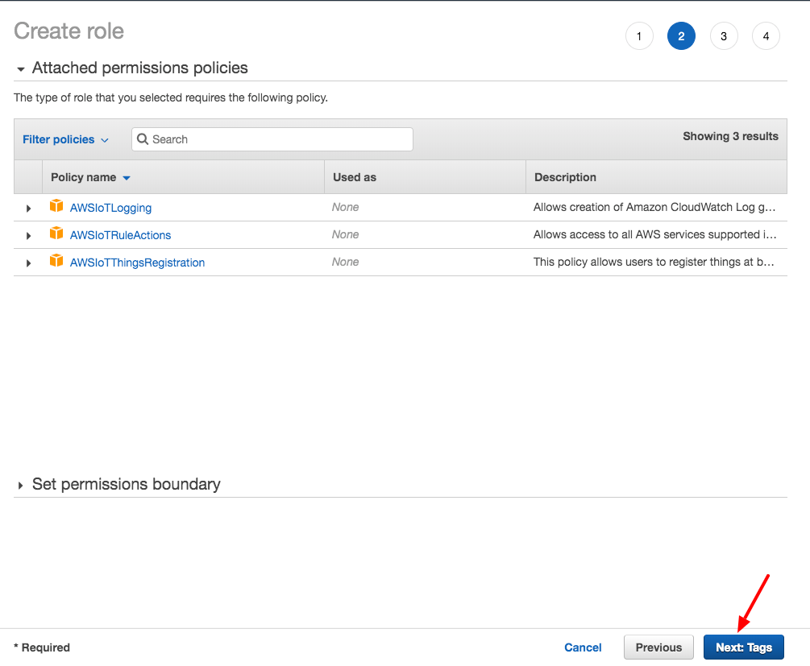
   - Press **Next: Review** button

   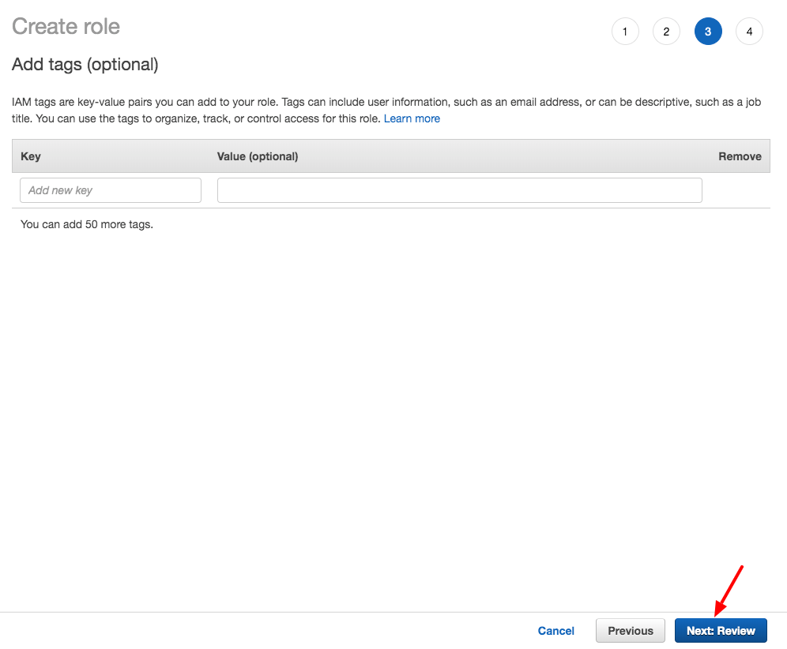
   - Enter a **Role name** = **IoTActionRole**
   - Press **Create role** button

   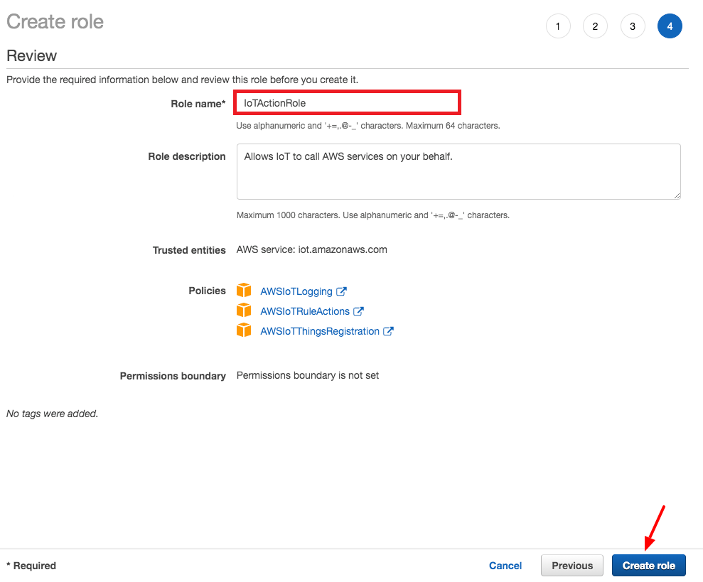
   - Enter **IoTActionRole** under search
   - Select **IotActionRole**

   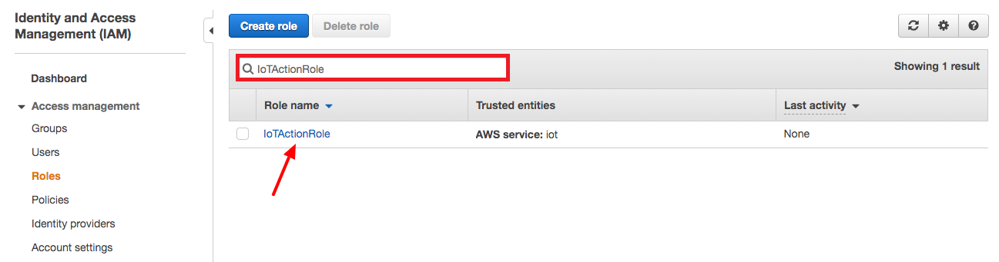
   - Select **Add inline policy**

   
   - Select **JSON** tab
   - Enter the following JSON
<pre>
{
  "Version": "2012-10-17",
  "Statement": {
    "Effect": "Allow",
    "Action": "iot:Publish",
    "Resource": "*"
  }
}
</pre>
  **NOTE: In a production environment you would typically use a more constrained Role**

   - Press **Review policy** button

   
   - Enter **Name** = **iot-publish**
   - Press **Create policy** button

   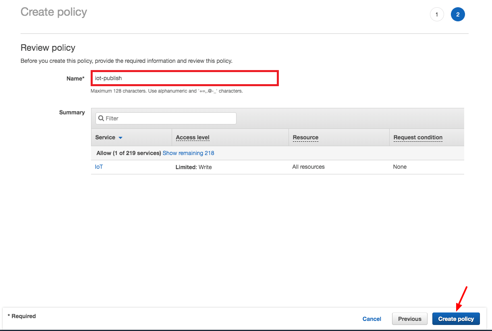

### 2. Create an IoT rule to turn on the cooler when temperature > 75F
In this workshop, we will be using an angle sensor to simulate a thermocouple (which measures temperature) since it is more easily manipuated for our testing. Additionally, we will use the blue LED to indicate that the water cooler is turned **on** or **off**.
   - Select **Services/IoT Core**, select **Act**, select **Rules**
   - Press **Create a rule** button

   
   - Enter **Name = CoolerOn**
   - Enter **Rule query statement = SELECT * FROM 'mything/temperature' WHERE value > 75**
   - Press **Add Action** button

   
   - Select **Republish a message to an AWS IoT topic**
   - Press **Configure action** button

   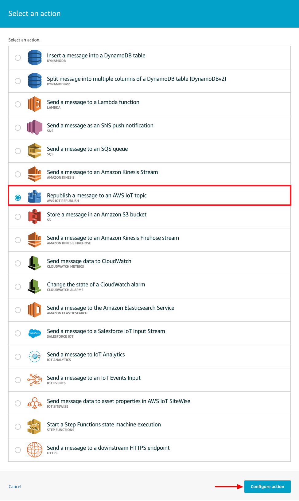
   - Enter **Topic = mything/blue/on**
   - Select **Quality of Service = 1**
   - Press **Select** to choose an existing role

   
   - Press **Select** next to the role named **IoTActionRole**
   

   
   - Press **Add action** button

   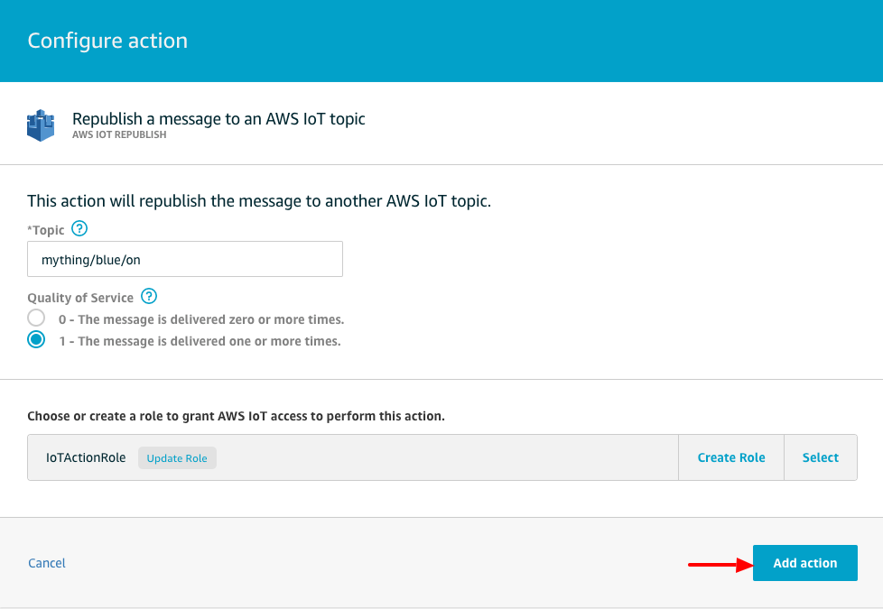
   - Press **Create Rule** button

   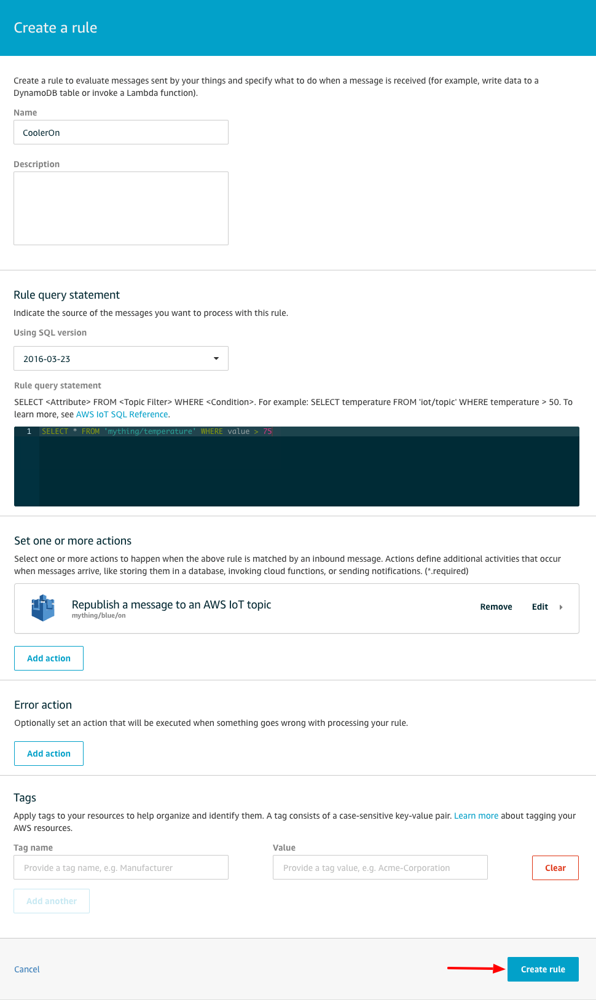
   - Once the rule indicates it's enabled you may test it (refresh your browser until it indicates "enabled").
   - Test the rule by turning the angle sensor until its value is over 75.
   - Once over 75 the blue LED will turn on.

### 3. Create an IoT rule to turn off the cooler when temperature < 50F
In this workshop, we will be using an angle sensor to simulate a thermocouple (which measures temperature) since it is more easily manipuated for our testing. Additionally, we will use the blue LED to indicate that the water cooler is turned **on** or **off**.
   - Select **Services/IoT Core**, select **Act**, select **Rules**
   - Press **Create** button

   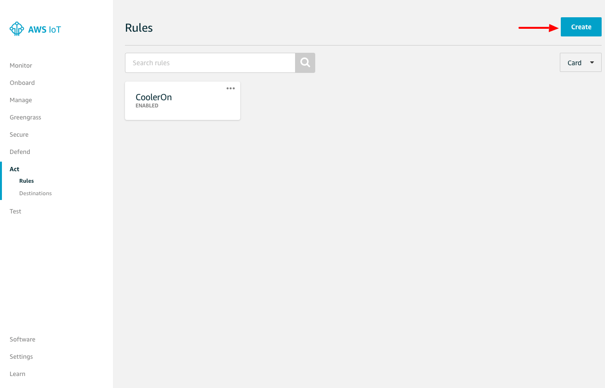
   - Enter **Name = CoolerOff**
   - Enter **Rule query statement = SELECT * FROM 'mything/temperature' WHERE value < 50**
   - Press **Add Action** button

   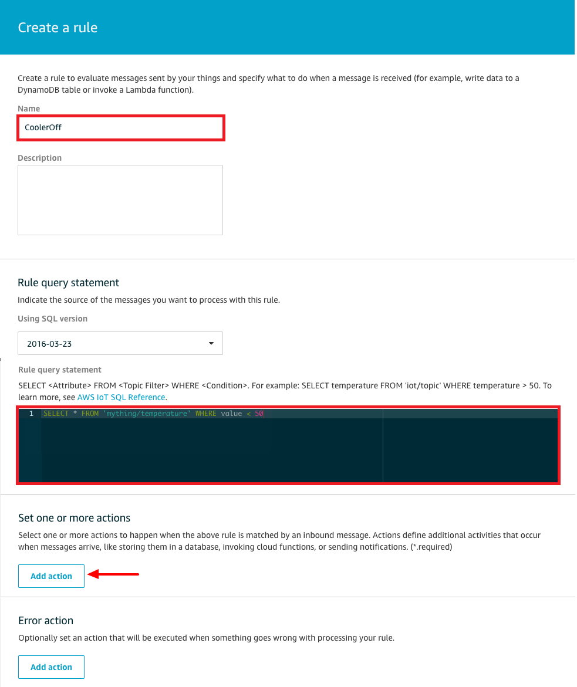
   - Select **Republish a message to an AWS IoT topic**
   - Press **Configure action** button

   
   - Enter **Topic = mything/blue/off**
   - Select **Quality of Service = 1**
   - Press **Select** to choose an existing role

   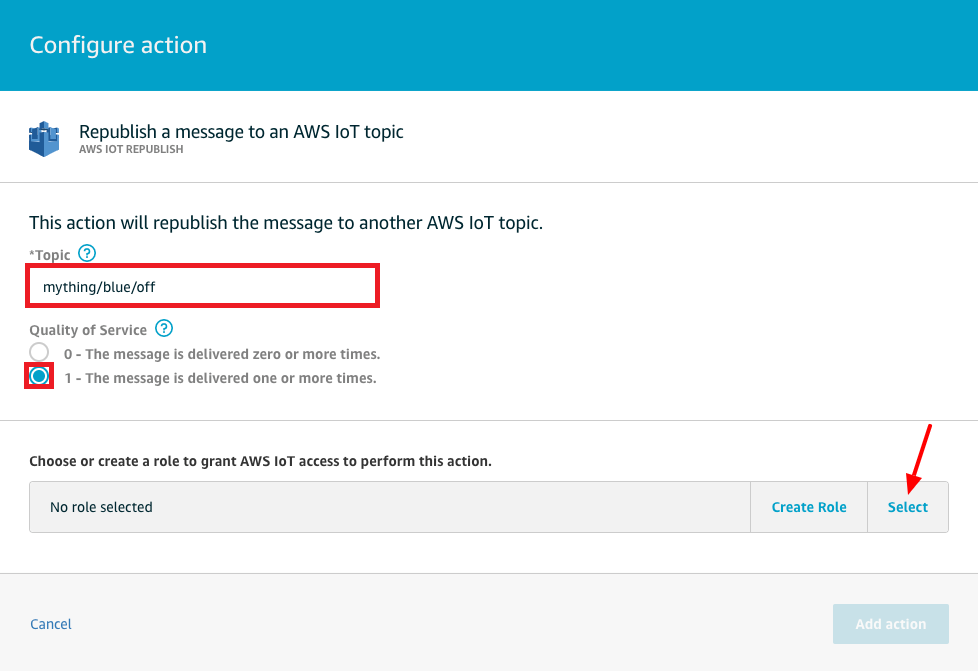
   - Press **Select** next to the role named **IoTActionRole**

   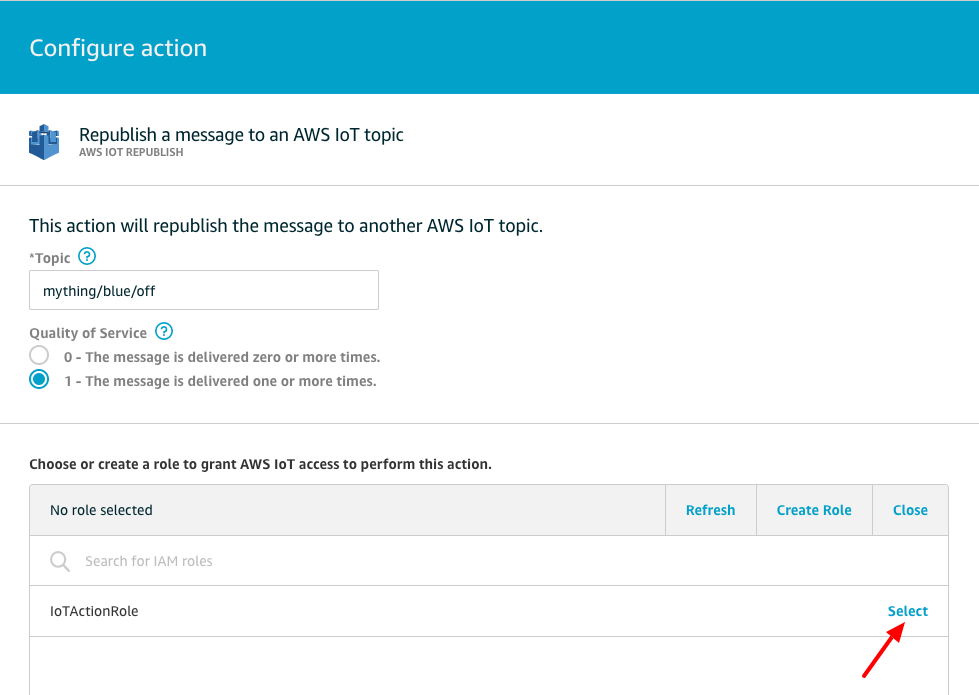
   - Press **Add action** button

   
   - Press **Create Rule** button

   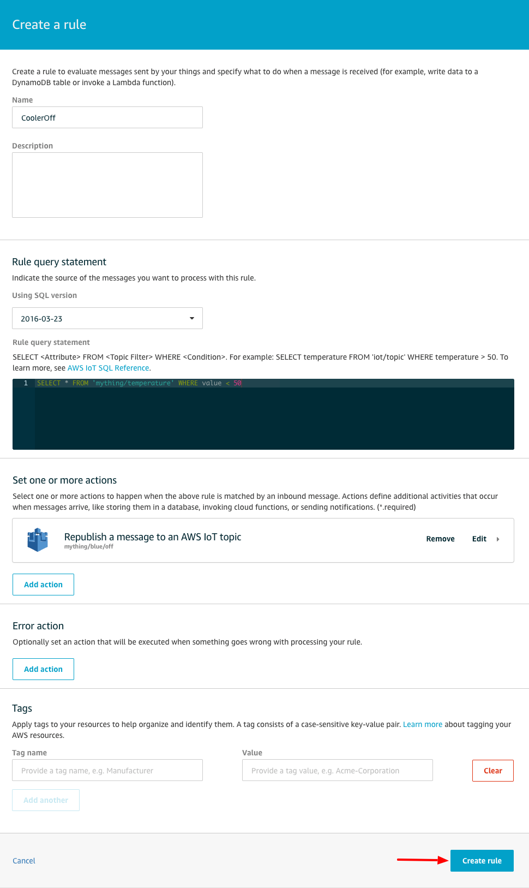
   - Once the rule indicates it's enabled you may test it (refresh your browser until it indicates "enabled").
   - Test the rule by turning the angle sensor until its value is under 50.
   - Once under 50 the blue LED will turn off.

### 4. Create advanced IoT rule that places a phone call when temperature < 32F (Below Freezing)
   **PART 1:** Create a Lambda function which will act as the rule's action

   - Launch the **Google Chrome Secure Shell App**
   - Enter a username of **ec2-user**, the IP address of your EC2 instance, enter port 22, select an Identity of **iot-virtual-device.pem** and press the **[ENTER] Connect** button.

   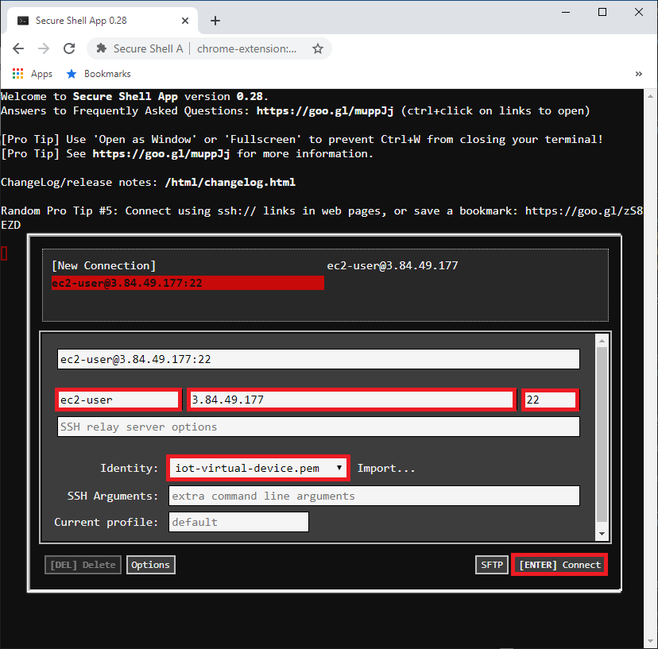

   [ec2-user@ip-172-31-29-44 ~]$ **cd ~/** 
   [ec2-user@ip-172-31-29-44 ~]$ **mkdir iot-workshop-lambda** 
   [ec2-user@ip-172-31-29-44 ~]$ **cd iot-workshop-lambda** 
   [ec2-user@ip-172-31-29-44 ~]$ **npm init** *(when prompted press enter to select the default value)* 
   [ec2-user@ip-172-31-29-44 ~]$ **npm -s install twilio** 

   
   - Use your favorite text editor to create a file named **index.js**.

   [ec2-user@ip-172-31-29-44 ~]$ **nano index.js** 

   
   - Copy and paste the code below into it

   **HINT: Right mouse button may be used to copy and paste when using Google Chrome SSH**

<pre>
const Twilio = require('twilio');

const accountSid   = process.env.accountSid;
const authToken    = process.env.authToken;
const twilioAPI    = process.env.twilioAPI;
const callingDN    = process.env.callingDN;
const calledDN     = process.env.calledDN;
const twilioClient = Twilio(accountSid, authToken);

function makeCall(from, to) {
  return new Promise((resolve, reject) => {
    twilioClient.calls.create({
      url: twilioAPI,
      from: from,
      to: to
    }).then(call => {
      resolve(call);
    }).catch(err => {
      reject(err);
    });
  });
}

exports.handler = async (event) => {
  try {
    await makeCall(callingDN, calledDN);
    return { statusCode: 200,
             body: 'Success' };
  }
  catch (err) {
    return { statusCode: 400,
             body: JSON.stringify(err) };
  }
};
</pre>

   - If using **nano** to edit the file then press **CTRL-X** to Exit and **Y** when prompted to save it
   - Once the file is saved, create a zip file of the Lambda function so we can deploy it to AWS  
   [ec2-user@ip-172-31-29-44 ~]$ **zip -r makecall.zip index.js node_modules package.json package-lock.json**  
   - Launch the **Google Chrome Secure Shell App** in another tab to start a SFTP session
   - Enter a username of **ec2-user**, the IP address of your EC2 instance, enter port 22, select an Identity of **iot-virtual-device.pem** and press the **SFTP** button.

   

   nasftp ./ > **cd ~/iot-workshop-lambda** 
   nasftp /home/ec2-user/iot-workshop-lambda/ > **get makecall.zip** 

   

  - Save file in your Downloads directory of your laptop.

   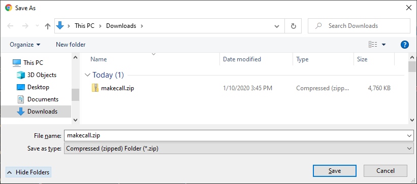

  - Deploy Lambda Function using the AWS Console
  - Select **Services/Lambda**
  - Press **Create function** button

   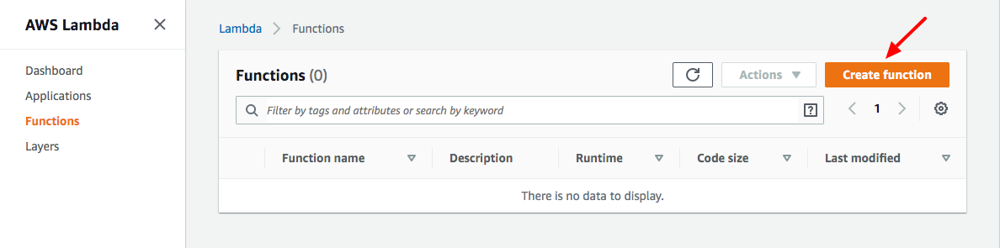

  - Select **Author from scratch**
  - Enter **Funcation name = MakeCall**
  - Select **Node.js 12.x** runtime
  - Press **Create function** button

  

  - Select **Code entry type = Upload a .zip file**
  - Press the **Upload** button

  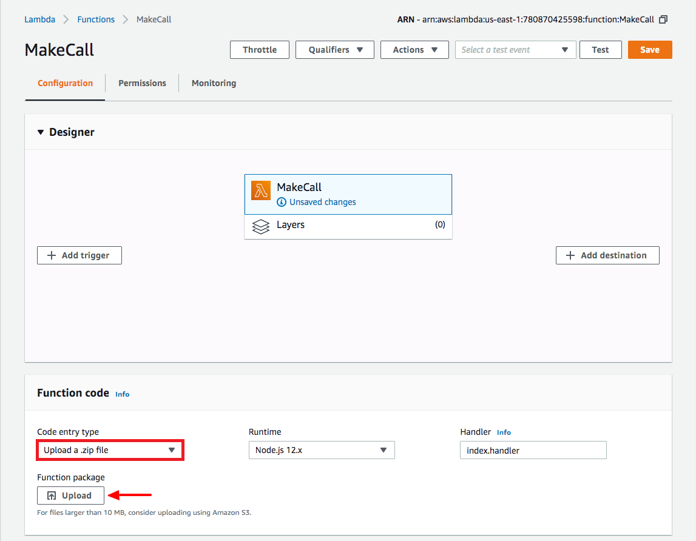

  - Select **Downloads/makecall.zip** file and press **Open** button

  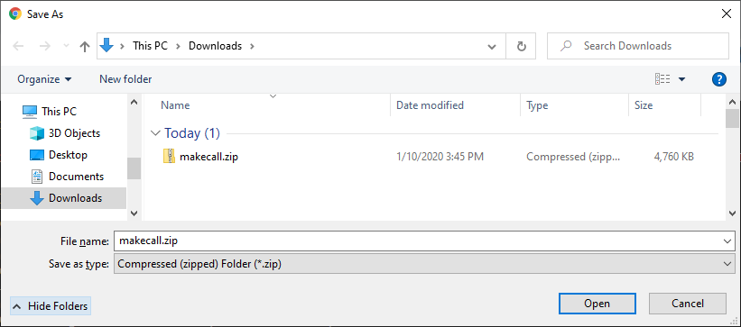

  - Under Environment variables enter the following:
    - accountSid = **WORKSHOP-ORGANIZER-WILL-PROVIDE-THIS-VALUE**
    - authToken = **WORKSHOP-ORGANIZER-WILL-PROVIDE-THIS-VALUE**
    - twilioAPI = http://demo.twilio.com/docs/voice.xml
    - callingDN = **WORKSHOP-ORGANIZER-WILL-PROVIDE-THIS-VALUE**
    - calledDN = **YOUR-CELL-PHONE** *(e.g. +16138675309)*
  - Press the **Save** button at the top of the page

  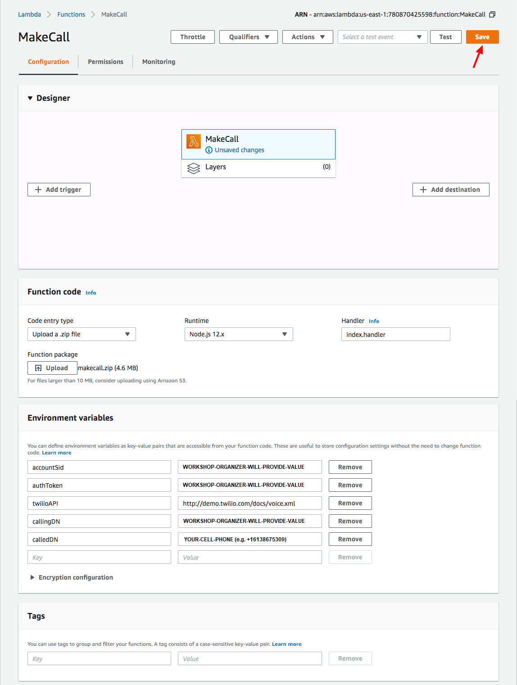
   - Select **Services/IoT Core**, select **Act**, select **Rules**
   - Press **Create** button

  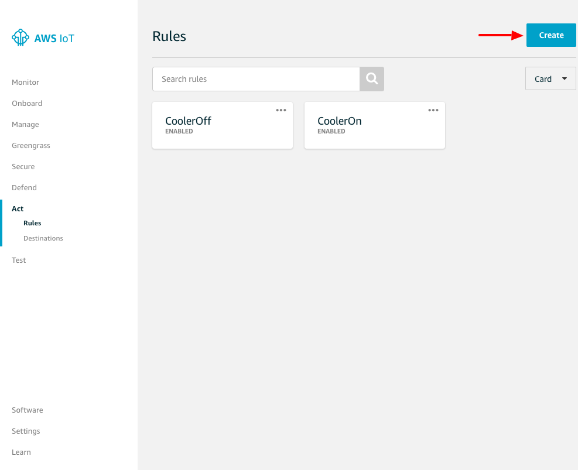
   - Enter **Name = MakeCall**
   - Enter **Rule query statement = SELECT * FROM 'mything/temperature' WHERE value < 32**
   - Press **Add Action** button

   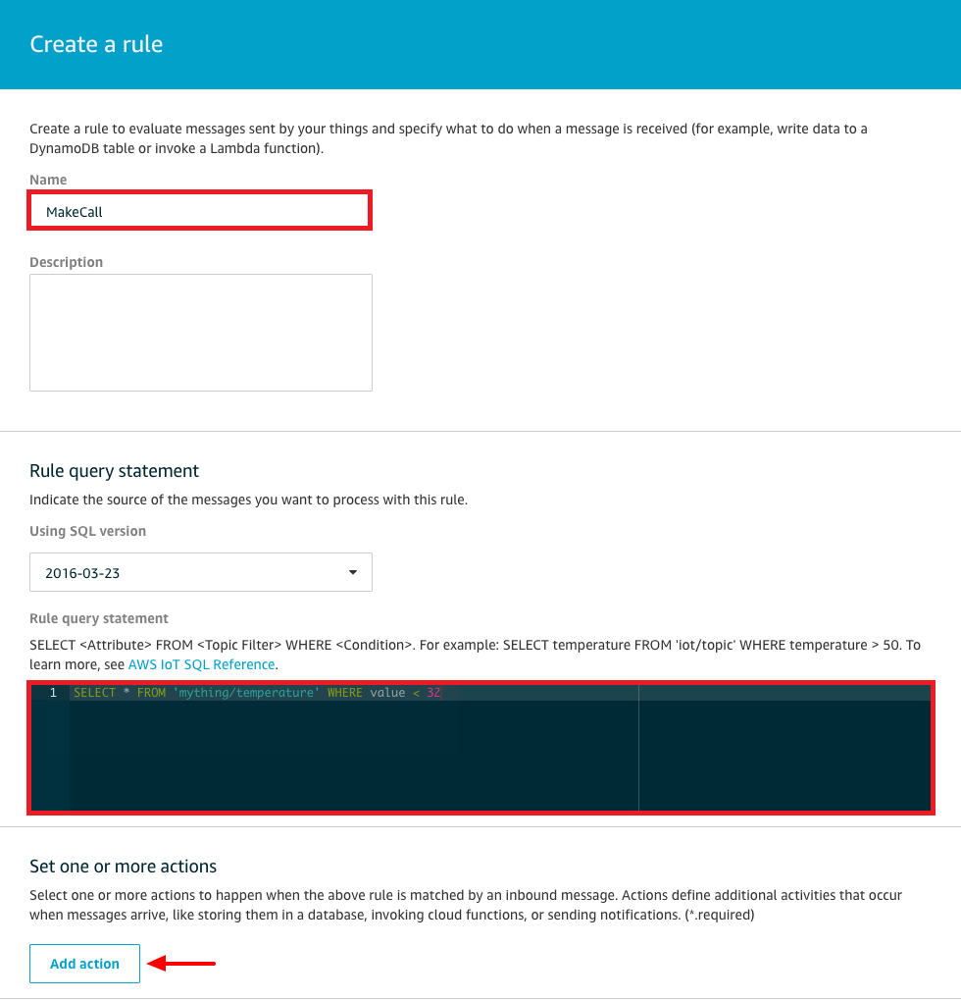
   - Select **Send a message to a Lambda function**
   - Press **Configure action** button

   
   - Under **Function name** press **Select** button

   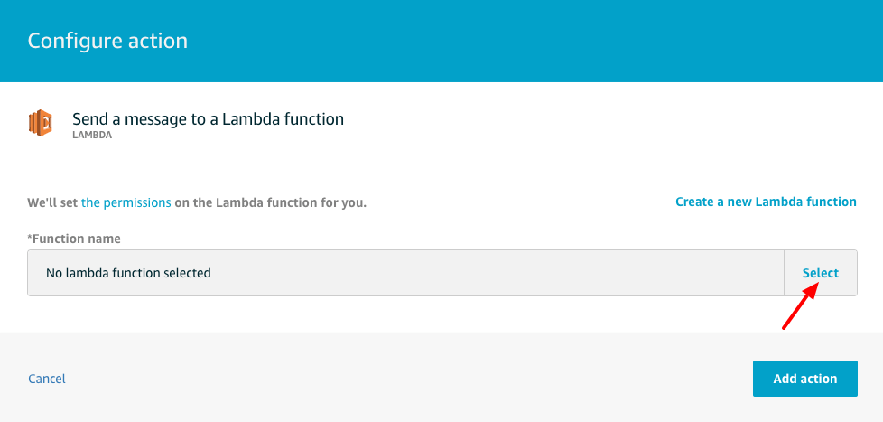
   - Press **Select** next to **MakeCall** Lambda function

   
   - Press **Add action** button

   
   - Press **Create rule** button
   
   
   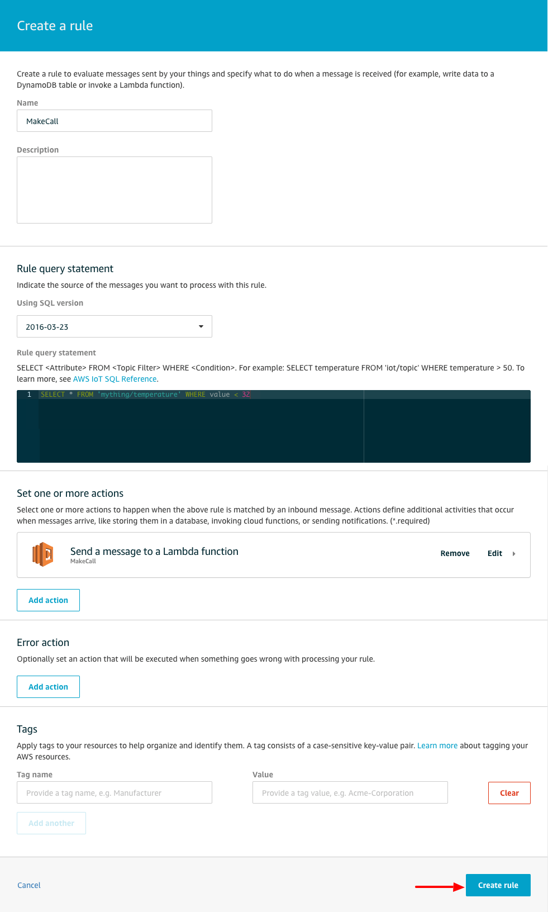
  - Once the rule indicates it's enabled you may test it (refresh your browser until it indicates "enabled").
   - Test the rule by turning the angle sensor until its value is under 32.
   - Once under 32 your cell phone will ring and when answered will play a message.

# Continue Workshop

[Part 4 - Web-based HMI (Human-Machine Interface)](./Workshop4-Virtual-HMI.md)