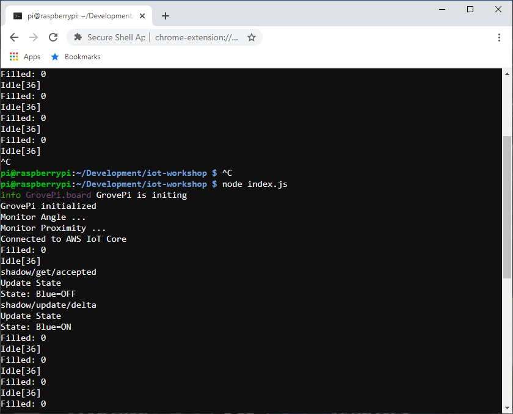

# PART 5: Thing Shadows

In a perfect world your IoT device will be connected to the Internet 24x7x365. However, there are scenarios where this just doesn't hold true. Specifically, there could be ISP outages, Internet outages due to power failures or design-level contraints where your IoT device is solar powered and must be constrained to only connect during select intervals. In order to help ease the control of your IoT devices in these situations, the AWS IoT Core system provides the **Device Shadow Service**. In this lab you will enhance your Raspberry Pi program to make use of a **Device Shadow** so that IoT client applications can get and set its state over MQTTS or HTTPS, regardless of whether it is connected to the Internet. Specifically, your application gets and sets the state of the device shadow and your device will synchronize its state with its device shadow when connectivity is re-established.

### Architecture

16x = 10*9/16

   

### 1. SSH onto Raspberry PI using Chrome SSH App

   - Launch the **Google Chrome Secure Shell App**
   - Enter a username of **pi**, the IP address displayed on the LCD screen connected to your Raspberry Pi, enter port **80** and press the **[ENTER] Connect** button.

   
   **NOTE: The password to use when logging in is written on your Raspberry Pi case. Also note that the IP address assigned to your Raspberry Pi may differ from the example shown in the screen capture below.**

   

### 2. Update your application to use a Thing Shadow

   pi@raspberrypi:~ $ **cd ~/Development/iot-workshop** 

   

   pi@raspberrypi:~ $ **nano index.js** 
   
   Copy and paste the following code into the nano edit session and save the file. 
   **IMPORTANT:** Replace the **host:** value with the Custom Endpoint value you took note of earlier 

<pre>
const AWSIoT  = require('aws-iot-device-sdk');
const Display = require('./display');</b>
const GrovePi = require('grovepi').GrovePi;
const Board   = GrovePi.board;
const Sensors = GrovePi.sensors;

const red    = new Sensors.DigitalOutput(2);
const blue   = new Sensors.DigitalOutput(3);
const buzzer = new Sensors.DigitalOutput(8);
const prox   = new Sensors.UltrasonicDigital(7);
const angle  = new Sensors.RotaryAnalog(0);

const DETECT_PROXIMITY = 5;
const DETECT_DURATION  = 2;    // 2 secs
const DISPENSE_RATE    = 200;  // 200 ml/sec
const PROCESS_INTERVAL = 1000; // 1000 msecs

const IDLE     = 0;
const DETECTED = 1;
const FILLING  = 2;

<b style="color:red">let ver         = 0;</b>
let device      = null;
let state       = IDLE; // IDLE, DETECTED or FILLING (Default = IDLE)
let proximity   = 200;  // 0 = nearest, 200 = farthest (Default = 200)
let temperature = 70;   // Fahrenheit (Default =70)
let time        = Date.now();
let total       = { filled: 0, volume: 0 };

function main() {
  const board = new Board({
    debug: true,
    onError: onGroveError,
    onInit: onGroveInit
  });

  board.init();

  device = AWSIoT.device({
    keyPath:  './certs/private.pem',
    certPath: './certs/cert.pem',
    caPath:   './certs/rootCA.pem',
    clientId: 'mything',
    region:   'us-east-1',
    protocol: 'mqtts',
    // IMPORTANT: REPLACE THE HOST VALUE BELOW WITH YOUR CUSTOM ENDPOINT VALUE
    host:     'a26erfmc9c0soi-ats.iot.us-east-1.amazonaws.com',
    debug:    'true'
  });

  device.on('connect', onConnect);
  device.on('message', onMessage);</b>
}

function onConnect() {
  console.log('Connected to AWS IoT Core');
  device.subscribe('mything/beep');
  device.subscribe('mything/red/#');
  device.subscribe('mything/blue/#');
  <b style="color:red">device.subscribe('$aws/things/mything/shadow/get/accepted');</b>
  <b style="color:red">device.subscribe('$aws/things/mything/shadow/update/delta');</b>
  device.publish('mything/dispenser', '{ "state": "idle", "time": ' + Date.now() + ' }');
  <b style="color:red">device.publish('$aws/things/mything/shadow/get', '');</b>
}

function onMessage(topic, buffer) {
  if (topic === 'mything/beep') {
    beep();
  }
  else if (topic === 'mything/red/on') {
    red.turnOn();
  }
  else if (topic === 'mything/red/off') {
    red.turnOff();
  }
  else if (topic === 'mything/blue/on') {
    blue.turnOn();
    <b style="color:red">reportState('on');</b>
  }
  else if (topic === 'mything/blue/off') {
    blue.turnOff();
    <b style="color:red">reportState('off');</b>
  }<b style="color:red">
  else if (topic === '$aws/things/mything/shadow/get/accepted') {
    console.log('shadow/get/accepted');
    updateState(buffer);
  }
  else if (topic === '$aws/things/mything/shadow/update/delta') {
    console.log('shadow/update/delta');
    updateState(buffer);
  }</b>
}

function onGroveError(err) {
  console.log('ERROR: ' + JSON.stringify(err));
}

function onGroveInit(res) {
  console.log('GrovePi initialized');
  monitorAngle();
  monitorProximity();
  setInterval(process, PROCESS_INTERVAL);
}

function beep() {
  console.log('Beep');
  buzzer.turnOn();
  setTimeout(() => { buzzer.turnOff(); }, 1000);
}

function monitorAngle() {
  console.log('Monitor Angle ...');

  angle.on('change', res => {
    temperature = res;
    device.publish('mything/temperature', '{ "value":' + temperature + ' }');
  });

  angle.watch(1000);
}

function monitorProximity() {
  console.log('Monitor Proximity ...');

  prox.on('change', res => {
    proximity = res;
  });

  prox.watch(1000);
}

function process() {
  let now       = Date.now();
  let duration  = Math.floor((now - time) / 1000);

  if (state === IDLE) {
    if (proximity > DETECT_PROXIMITY) {
      display('Idle', proximity, Display.GREEN);
    }
    else {
      state = DETECTED;
      time  = now;
      display('Detected', proximity, Display.BLUE, 0);
      device.publish('mything/dispenser', '{ "state":"detected" , "time":' + now + ' }');
    }
  }
  else if (state === DETECTED) {
    if (proximity > DETECT_PROXIMITY) {
      state = IDLE;
      display('Idle', proximity, Display.GREEN);
      device.publish('mything/dispenser', '{ "state":"idle", "time":' + now + ' }');
    }
    else if (duration >= DETECT_DURATION) {
      state = FILLING;
      time  = now;
      display('Filling', proximity, Display.RED, duration);
      device.publish('mything/dispenser', '{ "state":"filling", "time":' + now + ' }');
    }
    else {
      display('Detected', proximity, Display.BLUE, duration);
    }
  }
  else if (state == FILLING) {
    if (proximity > DETECT_PROXIMITY) {
      let dispensed = duration * DISPENSE_RATE;

      state = IDLE;
      total.filled += 1;
      total.volume += dispensed;
      beep();

      display('Idle', proximity, Display.GREEN);
      device.publish('mything/dispenser', '{ "state":"idle", "time":' + now + ' }');
      device.publish('mything/bottle', '{ "total":{ "filled":' + total.filled + ', "volume":' + total.volume + '},' +
                                          '"time":' + now + ', "duration":' + now + ', "volume":' + dispensed + ' }');
    }
    else {
      display('Filling', proximity, Display.RED, duration);
    }
  }
}

function display(state, proximity, color, duration) {
  if (duration) {
    Display.setText('Filled: ' + total.filled + '\n' + state + '[' + proximity + ']: ' + duration + 's', 1, color);
  }
  else {
    Display.setText('Filled: ' + total.filled + '\n' + state + '[' + proximity + ']', 1, color);
  }
}
<b style="color:red">
function updateState(buffer) {
  console.log('Update State');

  try {
    let message = JSON.parse(buffer.toString());

    if (ver < message.version) {
      ver = message.version;

      if (message.state.blue === 'on') {
        console.log('State: Blue=ON');
        blue.turnOn();
        reportState('on');
      }
      else {
        console.log('State: Blue=OFF');
        blue.turnOff();
        reportState('off');
      }
    }
  }
  catch (e) {
    console.log('ERROR: Failed to parse state buffer');
  }
}

function reportState(state) {
  device.publish('$aws/things/mything/shadow/update', '{ "state": { "reported": { "blue": "'+ state +'" } } }');
}
</b>
main();
</pre>

   - Start the application and connect your thing to AWS IoT Core 
   pi@raspberrypi:~ $ **cd ~/Development/iot-workshop** 
   pi@raspberrypi:~ $ **node index.js**

### 3. Test Connected Device Operations Using The Thing Shadow

**In one tab open the Thing Test page and publish Thing Shadow updates**
   - Login to AWS console
   - Go to **Services/IoT Core**
   - Select **Test**
   - Press **Publish to a topic** 
   - Specify a topic = **$aws/things/mything/shadow/update**
     and a body of the following
<pre>
  {
    "state": {
      "desired": {
        "blue": "on"
      }
    }
  }
</pre>
   - Press the **Publish to topic** button 
**Notice that the Raspberry Pi's blue LED turns on**

   

**In another tab open the Thing Shadow for your 'mything' device**
   - Login to AWS console
   - Go to **Services/IoT Core**
   - Select **Manage/Things**
   - Press **mything**
   - Select **Shadow** 
**Notice the "desired" and "reported" states show the blue LED are both "on"**

   

**Go back to the tab pane where you opened the Thing Test page to publish messages**
   - Specify a topic of **$aws/things/mything/shadow/update**
     and a body of the following
<pre>
  {
    "state": {
      "desired": {
        "blue": "off"
      }
    }
  }
</pre>
   - Press the **Publish to topic** button 
**Notice that the Raspberry Pi's blue LED turns off**

   

**Go back to the tab pane where you opened the Thing Shadow**

**Notice the "desired" and "reported" states show the blue LED are both "off"**

   

### 4. Test Disconnected Device Operations Using The Thing Shadow

**Go to the tab pane where you opened the SSH session to your Raspberry Pi**
   - Stop the running program by pressing Control-C (This will simulate a lost network connection)

   

**Go back to the tab pane where you opened the Thing Test page to publish messages**
   - Specify a topic of **$aws/things/mything/shadow/update**
     and a body of the following
<pre>
  {
    "state": {
      "desired": {
        "blue": "on"
      }
    }
  }
</pre>
   - Press the **Publish to topic** button 
**Notice that the Raspberry Pi's blue LED remains off**

**Go back to the tab pane where you opened the Thing Shadow**

**Notice the "desired" state is "on" while the "reported" state indicates its last know state is "off"**

   

**Go to the tab pane where you opened the SSH session to your Raspberry Pi**
   - Start the program running again (This will simulate the network restablishing connectivity)

   
**Notice that the Raspberry Pi's blue LED turns on**

**Go back to the tab pane where you opened the Thing Shadow**

**Notice the "desired" and "reported" states show the blue LED are both "on"**

   
